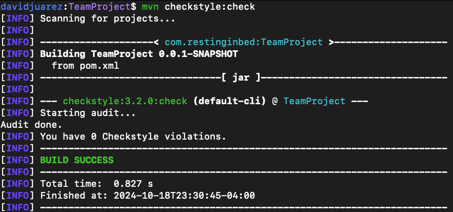

# COMS-4156-Project
This is the GitHub repository for the **service portion** of the Team Project associated with COMS 4156 Advanced Software Engineering. Our team name is RESTInBed and the following are our members: Ashley Garcia, David Juarez, Emily Chen, Lauren Dou, and Shreeya Patel.

## Building and Running a Local Instance
In order to build and use our service you must install the following:

1. Maven 3.9.5: https://maven.apache.org/download.cgi Download and follow the installation instructions, be sure to set the bin as described in Maven's README as a new path variable by editing the system variables if you are on windows or by following the instructions for MacOS.
2. JDK 17: This project used JDK 17 for development so that is what we recommend you use: https://www.oracle.com/java/technologies/javase/jdk17-archive-downloads.html
3. IntelliJ IDE: We recommend using IntelliJ but you are free to use any other IDE that you are comfortable with (even vim lol): https://www.jetbrains.com/idea/download/?section=windows
4. When you open IntelliJ you have the option to clone from a GitHub repo, click the green code button and copy the http line that is provided there and give it to your IDE to clone.
6. If you wish to run the style checker you can with <code>mvn checkstyle:check</code> if you wish to generate the report. 

Our endpoints are listed below in the "Endpoints" section, with brief descriptions of their parameters.

## Running Tests
Our unit tests are located under the directory 'src/test'. To run our project's tests in IntelliJ using Java 17, you must first build the project.

From there, you can right-click any of the classes present in the src/test directory and click run to see the results.

To see our system-level tests, see the section "Postman Test Documentation" below.

## Endpoints
This section describes the endpoints that our service provides, as well as their inputs and outputs.
Any malformed request such that there is an error in your wording or such that the API endpoint structure does not match what you are attempting to send you will receive a <code>HTTP 400 Bad Request</code> in response.

#### POST /createUser
* Expected Input Parameters: user (Client)
* Expected Output: Created user object (Client)
* Creates a new user in the system, should only be done once per the lifetime of the client. It must be called prior to any other calls being made.
* Upon Success: HTTP 201 Status Code is returned along with the created user object in the response body.
* Upon Failure: HTTP 500 Status Code is returned along with "An unexpected error has occurred" in the response body.

#### POST /createItem
* Expected Input Parameters: item (Item)
* Expected Output: Created item object (Item)
* Creates a new item in the system.
* Upon Success: HTTP 201 Status Code is returned along with the created item object in the response body.
* Upon Failure: HTTP 500 Status Code is returned along with "An unexpected error has occurred" in the response body.

#### POST /createOrganization
* Expected Input Parameters: organization (Organization)
* Expected Output: Created organization object (Organization)
* Creates a new organization in the system.
* Upon Success: HTTP 201 Status Code is returned along with the created organization object in the response body.
* Upon Failure: HTTP 500 Status Code is returned along with "An unexpected error has occurred" in the response body.

#### POST /resolveLocation
* Expected Input Parameters: locationQueryDTO (LocationQueryDTO)
* Expected Output: LocationResponseDTO containing latitude and longitude
* Resolves a location query to latitude and longitude using Google Places API.
* Upon Success: HTTP 200 Status Code is returned along with the location response in the response body.
* Upon Failure: HTTP 500 Status Code is returned along with "An unexpected error has occurred" in the response body.

#### GET /retrieveUser
* Expected Input Parameters: userID (Integer)
* Expected Output: User object (Client)
* Retrieves the details of a specified user.
* Upon Success: HTTP 200 Status Code is returned along with the user object in the response body.
* Upon Failure: HTTP 404 Status Code is returned with "User not found" if the user does not exist, or HTTP 500 Status Code with "An unexpected error has occurred" for other errors.

#### GET /retrieveItem
* Expected Input Parameters: itemID (Integer)
* Expected Output: Item object (Item)
* Retrieves the details of a specified item.
* Upon Success: HTTP 200 Status Code is returned along with the item object in the response body.
* Upon Failure: HTTP 404 Status Code is returned with "Item not found" if the item does not exist, or HTTP 500 Status Code with "An unexpected error has occurred" for other errors.

#### GET /retrieveOrganization
* Expected Input Parameters: organizationID (Integer)
* Expected Output: Organization object (Organization)
* Retrieves the details of a specified organization.
* Upon Success: HTTP 200 Status Code is returned along with the organization object in the response body.
* Upon Failure: HTTP 404 Status Code is returned with "Organization not found" if the organization does not exist, or HTTP 500 Status Code with "An unexpected error has occurred" for other errors.

#### PATCH /updateUser/{client_id}
* Expected Input Parameters: client_id (Long), client (Client)
* Expected Output: Updated user object (Client)
* Updates an existing user in the system.
* Upon Success: HTTP 200 Status Code is returned along with the updated user object in the response body.
* Upon Failure: HTTP 404 Status Code is returned with "User not found" if the user does not exist, or HTTP 500 Status Code with "An unexpected error has occurred" for other errors.

#### DELETE /deleteUser/{client_id}
* Expected Input Parameters: client_id (Long)
* Expected Output: Success message
* Deletes a user from the system.
* Upon Success: HTTP 200 Status Code is returned with "User deleted successfully".
* Upon Failure: HTTP 404 Status Code is returned with "User not found" if the user does not exist, or HTTP 500 Status Code with "An unexpected error has occurred" for other errors.

#### PATCH /updateItem/{itemID}
* Expected Input Parameters: itemID (Integer), item (Item)
* Expected Output: Updated item object (Item)
* Updates an existing item in the system.
* Upon Success: HTTP 200 Status Code is returned along with the updated item object in the response body.
* Upon Failure: HTTP 404 Status Code is returned with "Item not found" if the item does not exist, or HTTP 500 Status Code with "An unexpected error has occurred" for other errors.

#### DELETE /deleteItem/{itemID}
* Expected Input Parameters: itemID (Integer)
* Expected Output: Success message
* Deletes an item from the system.
* Upon Success: HTTP 200 Status Code is returned with "Item deleted successfully".
* Upon Failure: HTTP 404 Status Code is returned with "Item not found" if the item does not exist, or HTTP 500 Status Code with "An unexpected error has occurred" for other errors.

## Style Checking Report
We used the tool "checkstyle" with the configuration file "google_checks.xml" to check the style of our code and generate style checking reports. Here is the report
as of the day of 10/18/2024 (These can be found in the reports folder):



## Branch Coverage Reporting
We used JaCoCo to perform branch analysis in order to see the branch coverage of the relevant code within the code base. See below for screenshots demonstrating output.


## PMD
We added Maven PMD plugin to our pom.xml file and used our own ruleset. Note: our ruleset is just the default ruleset taken from https://maven.apache.org/plugins/maven-pmd-plugin/examples/usingRuleSets.html

To run PMD
```
mvn pmd:pmd
```
To view results
```
open target/reports/pmd.html
```


## Project Management
We used Trello cards to do our project management


## An Initial Note to Developers
If you're a developer who wants to use this service for an app or something, make sure you're using a language that is capable of comminicating with our API. Host the service on your own hardware/server, our project does not use docker containers. Build, test, and run a local instance as described above.

## Tools used
This section includes notes on tools and technologies used in building this project, as well as any additional details if applicable.

* PostgreSQL
* Maven Package Manager
* Checkstyle
  * We use Checkstyle for code reporting.
  * For running Checkstyle manually, you can use the "Checkstyle-IDEA" plugin for IntelliJ.
* JaCoCo
  * We use JaCoCo for generating code coverage reports.
  * Originally we were planning on using Cobertura, however Cobertura does not support our version of Java.

## Third Party API Documentation
We made extensive use of the Google Maps API, particularly the Places API for location-based services and plan to integrate the Distance Matrix API to calculate distances and travel times. Here is a link to the full documentation provided by Google on how to use the various components, which gives insight into how we are managing this aspect of the project: https://developers.google.com/maps/documentation
